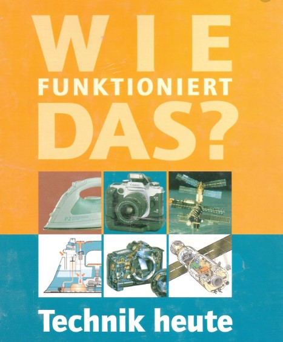
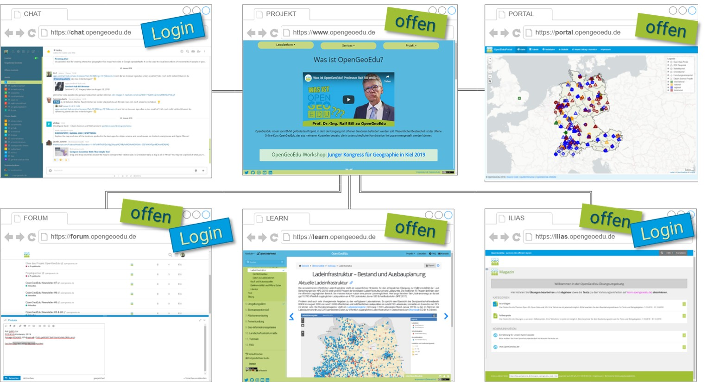

# NØRD

***

***

OpenGeoEdu - Offene Daten für Lehre und Forschung in raumbezogenen Studiengängen

***

## OpenGeoEdu

soll die Nutzung von offenen Geodaten in raumbezogenen Studiengängen anhand von Best-Practice-Beispielen illustrieren und darauf aufbauend E-Learning-Angebote für die  Integration in einer Vielzahl von Studiengängen bereitstellen.

***

***

<!-- URKEL -->

***

#### Wie funktioniert das?

### Lernen mit offenen Daten?!

<section>

</section>

***

### Komponenten der Lernplattform

***

# Portal

<section>
<iframe width="800" height="350" src="https://www.youtube.com/embed/Wme69PADVLo" frameborder="0" allow="accelerometer; autoplay; encrypted-media; gyroscope; picture-in-picture" allowfullscreen></iframe>
</section>

***

# Werkzeuge

<section>
<iframe width="400" height="225" src="https://www.youtube.com/embed/GyHg-Dsl3pM" frameborder="0" allow="accelerometer; autoplay; encrypted-media; gyroscope; picture-in-picture" allowfullscreen></iframe>
<iframe width="400" height="225" src="https://www.youtube.com/embed/F87llh3rqmE" frameborder="0" allow="accelerometer; autoplay; encrypted-media; gyroscope; picture-in-picture" allowfullscreen></iframe>
</section>

***

<section data-background="offeneLernplattform.png"  data-background-color="" data-background-size="contain"">
</section>

***

<!-- KIP-->

***

<!-- the3nerds-->

***

<!-- interesting kangaroo-->

***

<section data-background="komponenten.png"  data-background-color="" data-background-size="contain"">
</section>

***

Vielen Dank

Kontakt:

@twoeLLph / @oeLLph@mastodon.social