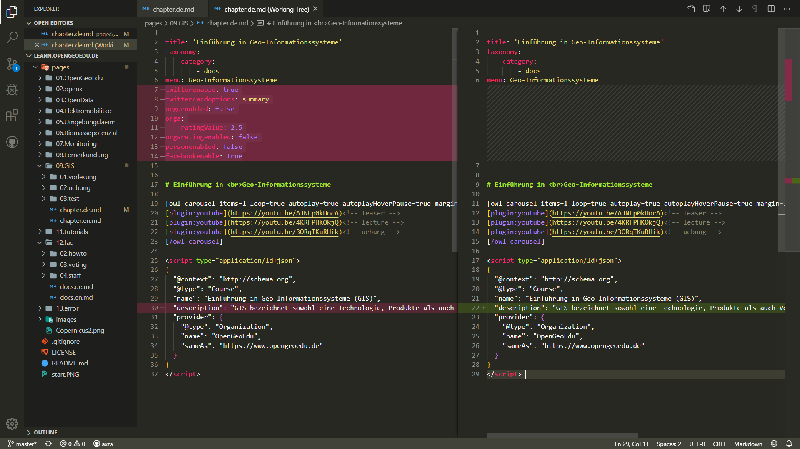
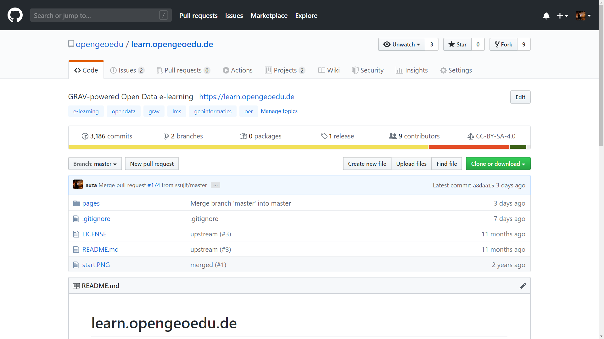
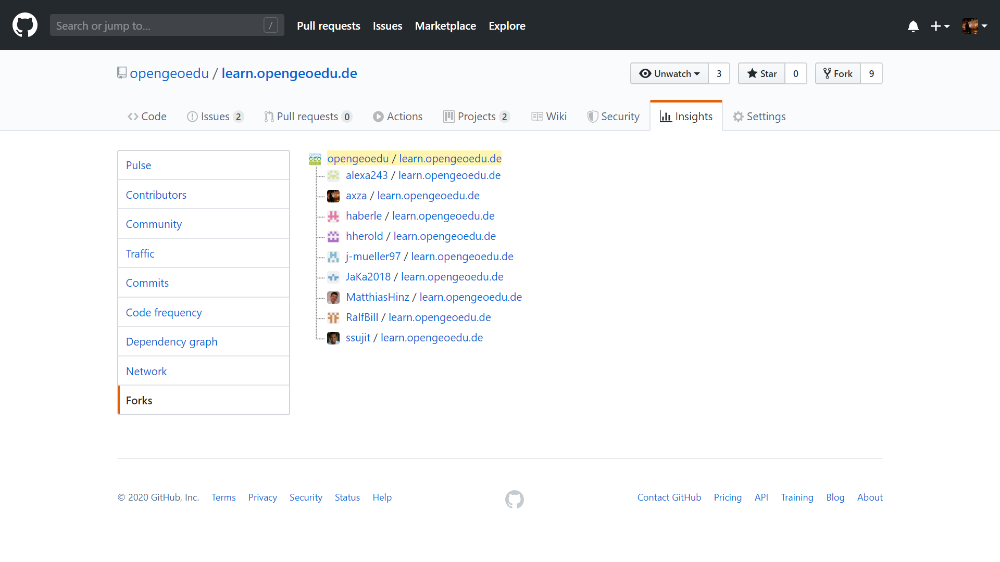
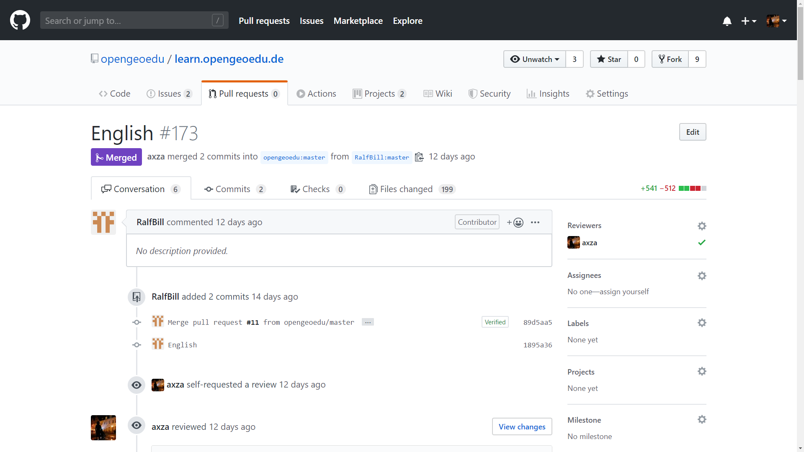

  

# Workshop

#### Campustagung 2020

***

## OpenGeoEdu

soll die Nutzung von offenen Geodaten in raumbezogenen Studiengängen anhand
von Best-Practice-Beispielen illustrieren und darauf aufbauend E-Learning-Angebote für die Integration
  in einer Vielzahl von Studiengängen bereitstellen.

***

#### Wie funktioniert das?

### Lernen mit offenen Daten?!

<section>
  
  
  
</section>

***

### Komponenten der Lernplattform

***

***

[learn.opengeoedu.de](https://learn.opengeoedu.de)

***

[ilias.opengeoedu.de](https://ilias.opengeoedu.de)

***

## Erstellung und Bearbeitung

#### von Lerninhalten

***

VS Code

***

GitHub

***

***

